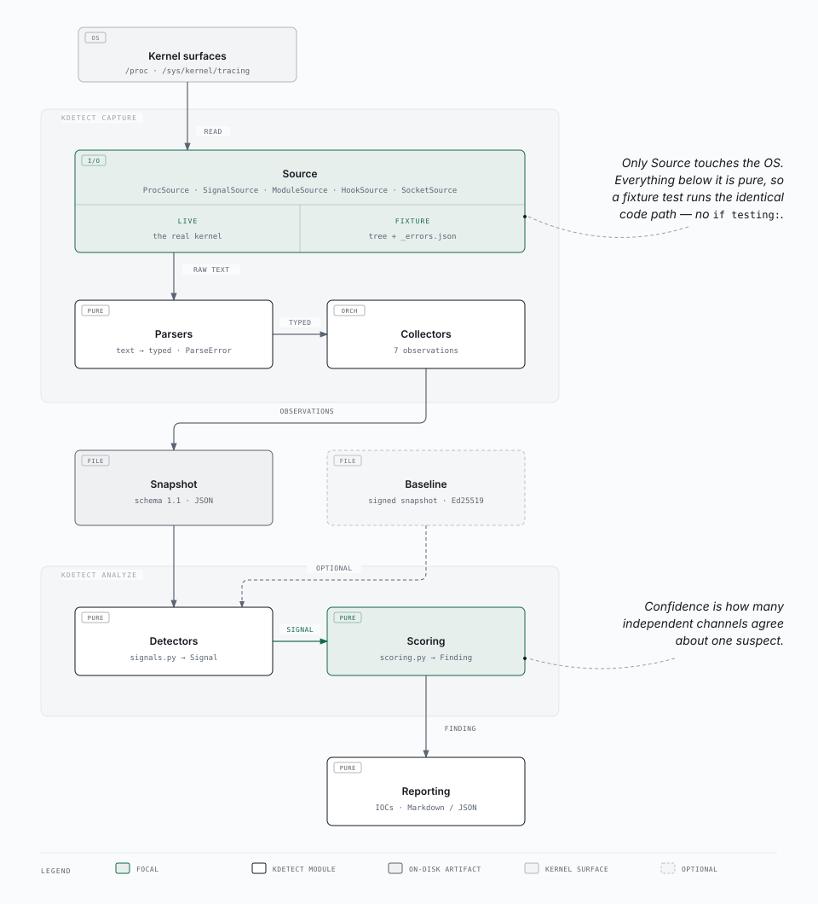

# kdetect

[](https://github.com/basil9099/kdetect/actions/workflows/tests.yml)

Linux kernel rootkit detection via cross-view comparison.

A rootkit hides by lying to whoever asks. kdetect asks the same question through
several channels that a rootkit has to subvert separately, then treats their
disagreement as the finding. It asks whether two views of the system agree,
records both answers, and reports where they diverge.

The architecture follows from that, via the principles in
[`docs/architecture.md`](docs/architecture.md): snapshots hold evidence and never
conclusions (P1), disagreement between collectors stays representable rather than
resolved at capture time (P2), and every finding names both the channels that saw
a thing and the channel that denied it.

- [`docs/architecture.md`](docs/architecture.md): how it is put together
- [`docs/detection-methods.md`](docs/detection-methods.md): what it detects and why
- [`docs/limitations.md`](docs/limitations.md): what it cannot detect
- [`docs/threat-model.md`](docs/threat-model.md): who it is defending against

## How cross-view detection works

A hidden process is the clearest case. `/proc` readdir is the listing everything
uses, and it is exactly what a process-hiding rootkit filters. So kdetect does not
trust it alone:

- **readdir**: walk `/proc` twice, recording what the listing offers
- **syscall**: sweep every possible task id with `kill(pid, 0)`, which answers
  from the kernel's task table rather than the directory
- **direct read**: read `/proc/<tid>/status`, bypassing the listing again
- **sockets**: attribute open sockets to owning pids through `/proc/<pid>/fd`

A pid confirmed by the syscall sweep, a direct read, and a socket owner, but
absent from the readdir listing, is hidden. One channel alone is LOW confidence;
three independent channels agreeing is HIGH. The same shape applies to modules:
`/proc/modules` is the listing, while kernel taint bits, unaccounted vmalloc
regions, and ftrace hook ownership are channels a module must suppress separately.

## Architecture



Two pure pipelines sit above one impure layer. `Source` is the only code that
touches the operating system, and a collector receives its source as an argument
rather than constructing one, so a fixture-driven test exercises the identical
code path as a live capture. Everything below that seam is pure: parse, collect,
detect, score, render.

The full reasoning, including the three principles the layout follows and the
snapshot format, is in [`docs/architecture.md`](docs/architecture.md).

## Install

Requires Python 3.11+. One runtime dependency, `cryptography`, used for ed25519
baseline signatures.

```bash
pip install -e .
```

`kdetect capture` needs a live `/proc`, so it runs on Linux only. `analyze`,
`report` and `redact` work on a captured JSON file on any platform, so you can
capture on the suspect host and analyse somewhere you trust.

## Try it

The repository ships real captures from a lab VM, so the example below runs with
no VM and no root. `infected-hooktest.json` was taken while a purpose-built kernel
module was loaded and hiding itself, and every process command line in it has been
replaced by `kdetect redact`. The three older fixtures predate that command and
keep their command lines, with session tokens scrubbed in place;
`tests/unit/test_analyze.py` asserts none of them carries a live token.

```bash
kdetect analyze tests/fixtures/snapshots/infected-hooktest.json
```

```
  procfs.modules   trust=LOW   status=OK   74 entities   0ms
                     listed=74
  kernel.module_evidence   trust=MEDIUM   status=OK   0 entities   93ms
                     ftrace_available=True  ftrace_module_count=70  load_module_regions=75  taint=12288
  kernel.hooks   trust=MEDIUM   status=OK   1 entities   71ms
                     enabled_functions_available=True  hooks=1  kallsyms_available=True  kprobes_available=True

findings:
  [HIGH]   hidden_module   module kdetect_hooktest
           seen by: taint, unexpected_hook, vmalloc_region
           denied by: procfs.modules listing
```

Three channels named the module and the listing denied it: 75 module regions in
vmalloc against 74 listed, and taint bits 12 and 13 set with no listed module
accounting for them.

For a shareable artifact rather than terminal triage:

```bash
kdetect report tests/fixtures/snapshots/infected-hooktest.json
```

```markdown
## Summary
- HIGH: 1 · MEDIUM: 0 · LOW: 0
- Verdict: 1 finding(s) — hidden_module. Investigate.

## Findings
### [HIGH] hidden_module — module kdetect_hooktest
module kdetect_hooktest is concealed from /proc/modules but named by taint, unexpected_hook, vmalloc_region
- Seen by: taint, unexpected_hook, vmalloc_region
- Denied by: procfs.modules listing
  - taint: [{'taint': 12288, 'listed_taint_markers': 0, 'bits': [12, 13]}]
  - unexpected_hook: [{'function': '__x64_sys_newuname', 'hook_type': 'ftrace', 'callback': 'kdetect_callback', 'owner_module': 'kdetect_hooktest'}]
  - vmalloc_region: [{'load_module_regions': 75, 'listed': 74, 'unaccounted': 1}]

## Indicators of Compromise
- hooked_function: `__x64_sys_newuname` (HIGH)
- kernel_module: `kdetect_hooktest` (HIGH)
```

The report concludes nothing of its own. It presents what `analyze` found, and
every line traces back to a finding or a recorded fact. IOCs are the portable
indicators worth carrying to another host: a module name, a hooked syscall, a C2
endpoint, a process name. Host-local artifacts like pids and inodes stay as
context.

## Commands

- `kdetect capture [--out PATH] [--pretty]`: snapshot the live system to a
  JSON file (default: a generated name under `captures/`).
- `kdetect analyze <snapshot> [--json] [--baseline PATH --verify-key PATH]`:
  summarise a snapshot's findings on the terminal; exits 3 if any are present.
- `kdetect baseline <snapshot> --out PATH --sign-key PATH`: sign a clean
  snapshot as a baseline for future drift detection.
- `kdetect report <snapshot> [--format md|json] [--out PATH] [--baseline PATH --verify-key PATH]`:
  render a shareable Markdown or JSON report of a snapshot's findings and
  indicators of compromise; exits 3 if any findings are present.
- `kdetect redact <in.json> <out.json>`: scrub a snapshot's process command
  lines before sharing it.

Exit codes are scriptable: 3 means findings were produced, 0 none, 1 an error
(including a baseline whose signature fails), 2 a usage problem. A non-zero exit
from `analyze` or `report` is a detection, not a crash.

## What it detects

Ten of the twelve numbered detection methods are implemented, documented
individually in [`docs/detection-methods.md`](docs/detection-methods.md). One more
is implemented as a constraint on what kdetect can read, and one is planned.

| Finding | Channels that must disagree |
|---|---|
| `hidden_process` | `syscall_kill`, `direct_status`, `socket_visible` vs `/proc` readdir |
| `hidden_module` | `taint`, `vmalloc_region`, `ftrace_orphan`, `unexpected_hook` vs `/proc/modules` |
| `suspected_hidden_module` | anonymous indicators that fire but name no module |
| `baseline_drift` | a module present now but absent from a signed baseline |

Confidence is corroboration count, scoped per suspect: one channel is LOW, two
MEDIUM, three or more HIGH. Baselines are ordinary snapshots plus a detached
ed25519 signature, verified before parsing.

Validated against real rootkits on Debian 12 / kernel 6.1.0-52. Diamorphine's
hidden module was caught three independent ways, and a purpose-built hiding module
(`kmod/kdetect_hooktest.c`) is the committed ground truth for hook detection.

## What it cannot detect

[`docs/limitations.md`](docs/limitations.md) records 26 numbered limitations, each
one traced to captured evidence under `docs/step0*/` rather than asserted. The
shape of them:

- **A rootkit that hides from every channel is invisible.** Cross-view finds
  inconsistency, not malice. A rootkit that patches all views coherently, or one
  operating below where kdetect can look, produces no disagreement and no finding.
- **kdetect runs on the machine it is inspecting**, parsing input a kernel-level
  attacker can influence, so a sufficiently privileged rootkit can lie to it.
  On-host signing bounds this but does not solve it; off-host verification is
  phase 5.
- **Some evidence needs root**, and some is unavailable regardless: a hidden
  process's `exe` and `cmdline` cannot be recovered, because the collector that
  records them is the readdir path the rootkit suppressed (L26).

## Project status

v1.0. Built in phases, each with a design spec and an implementation plan under
[`docs/superpowers/`](docs/superpowers/):

| Phase | Delivered |
|---|---|
| 1 | capture → JSON → analyze round-trip; schema and evidence discipline |
| 2 | cross-view process and module detection; syscall sweep |
| 3a | hook-surface integrity; signed baselines |
| 3b | detect → score split; per-suspect composition |
| 4a | network sockets; proc↔socket correlation; HIGH `hidden_process` |
| 4b | reporting, IOC extraction, redaction |

Deferred to phase 5: eBPF collectors, out-of-band memory forensics, and off-host
baseline verification.

## Development

```bash
pytest tests
```

The unit and analysis tiers are pure and run anywhere. The integration tier is
marked `needs_procfs` and skips silently off Linux, so the suite is only
meaningfully complete on a Linux host.

Two constraints worth knowing before contributing:

- **Python 3.11 is the floor, and it is enforced.** A 3.12-only construct once
  passed the whole suite on a 3.12 workstation and broke on import on the 3.11 lab
  VM. `tests/unit/test_python311_compat.py` now guards against that class of
  mistake across both `src/` and `tests/`.
- **Snapshots are redacted before they become fixtures.** A capture holds every
  visible process's `cmdline`, which can carry credentials passed as arguments.
  Run `kdetect redact` first, and note that it scrubs `cmdline` only, not `exe`
  paths, hostnames, or socket addresses.

## Lab safety

Live rootkit work belongs on a disposable VM with a snapshot to revert to, never
on a workstation. Rootkit source and binaries are deliberately excluded from this
repository: `.gitignore` drops all of `lab/targets/**`, and only kdetect's own
benign test module (`kmod/kdetect_hooktest.c`) is committed. Never push from a
host while a rootkit is loaded.

## Licence

MIT, except the kernel module under `kmod/`, which is GPL-2.0 because a Linux
kernel module must be GPL-compatible to use GPL-only kernel symbols. See
[`LICENSE`](LICENSE).
